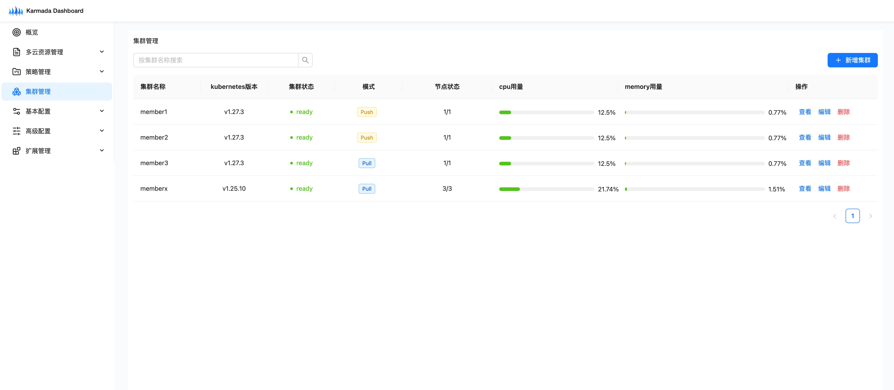

# Karmada Dashboard

## Introduction

Karmada (Kubernetes Armada) is a Kubernetes management system that enables you to run your cloud-native applications across multiple Kubernetes clusters and clouds, with no changes to your applications. By speaking Kubernetes-native APIs and providing advanced scheduling capabilities, Karmada enables truly open, multi-cloud Kubernetes.

Karmada Dashboard is a general purpose, web-based UI for Karmada management. With Karmada Dashboard, you can access your Kubernetes clusters easily, and you can manage all kinds of resources seamlessly cross multiple Kubernetes clusters and clouds. 

## Installation

TBD

## Documentation

Dashboard documentation can be found in the [docs](docs/README.md) directory which contains:

* [Developer Guide](DEVELOPMENT.md): Important information for contributors that would like to test, run and work on Dashboard locally.

## Community, discussion, contribution, and support
TBD

### Contribution
TBD

### Code of conduct
TBD

## License

[Apache License 2.0](https://github.com/warjiang/karmada-dashboard/blob/main/LICENSE)
